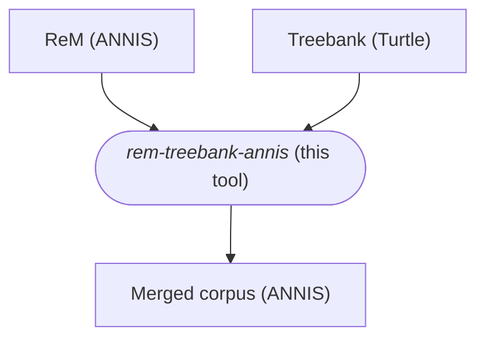
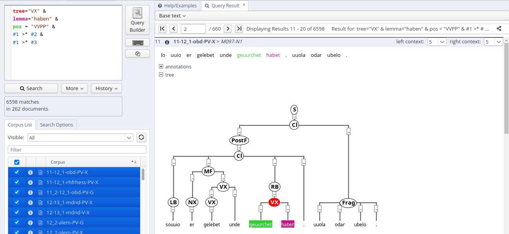
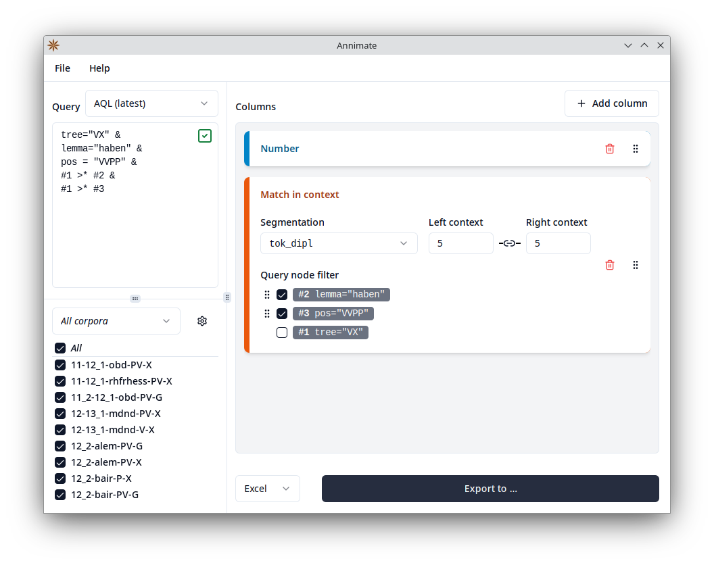

# ReM Treebank to ANNIS Converter

This tool converts the Treebank edition[^1] of the Referenzkorpus Mittelhochdeutsch[^2] into the ANNIS[^3] format.

## Overview

The [Referenzkorpus Mittelhochdeutsch](https://www.linguistics.rub.de/rem/index.html) (ReM) is originally provided in
the [CorA](https://cora.readthedocs.io/en/latest/) format, but is usually queried through
the [ANNIS](https://corpus-tools.org/annis/) system.
The [ReM Treebank](https://github.com/acoli-repo/germhist/tree/master/ReM) provides an additional layer of syntactic
annotations over the ReM in the CoNLL and RDF [Turtle](https://www.w3.org/TR/turtle/) formats.
This tool takes the original ReM data in the ANNIS format and the ReM Treebank data in the Turtle format and merges them
into a combined corpus in the ANNIS format that can then be queried through tooling of the ANNIS ecosystem such as
the [ANNIS web UI](https://github.com/korpling/ANNIS) or [Annimate](https://github.com/matthias-stemmler/annimate).



## Usage

1. Download the original ReM data in version 1.0

   The data need to be provided as a `.zip` file containing relANNIS or GraphML corpora.
   For instance, relANNIS data can be downloaded from [LAUDATIO](https://www.laudatio-repository.org/browse/corpus/xCS3CnMB7CArCQ9C3LRB/corpora) ([direct download link](https://www.laudatio-repository.org/download/format/1/36/1.0)). You need to unzip the downloaded file to obtain the file `rem-relannis-20161223_1-0.zip`, which can then be used as an input to this tool.

   _Note:_ The ReM Treebank data are based on ReM 1.0, so make sure you download this version.

2. Download the ReM Treebank data

   The data need to be provided as a directory containing Turtle (`.ttl`) files following a certain naming scheme.
   Download the [ttlchunked](https://github.com/acoli-repo/germhist/tree/master/ReM/full_corpus/ttlchunked) directory from the [acoli-repo/germhist](https://github.com/acoli-repo/germhist) repository on GitHub, e.g. by cloning the repository using Git.

3. Download the source code of the _rem-treebank-annis_ tool, e.g. by cloning this repository.

4. Make sure you have a [Rust toolchain](https://www.rust-lang.org/tools/install) installed.

   A minimum Rust version of 1.80 is required.

5. Build and run the _rem-treebank-annis_ tool via the command line as described below.

### Running the Tool

The _rem-treebank-annis_ tool can be run via the command line as follows:

```
cargo run --release -- [OPTIONS] <INPUT ANNIS ZIP> <INPUT TTL DIRECTORY>
```

Here,

- `<INPUT ANNIS ZIP>` is the path of the ANNIS `.zip` file downloaded in step 1
- `<INPUT TTL DIRECTORY>` is the path of the directory containing the `.ttl` files downloaded in step 2

The following options are available:

- `--output <ANNIS ZIP>`

  Path to output corpus, will be a `.zip` file containing the merged corpora in the GraphML format

  **Default:** like input corpus, but with `.out.zip` extension

- `--rename <PATTERN>`

  If specified, rename corpora using this pattern

  Must contain the placeholder `%c` representing the original corpus name

  E.g. when `--rename %c_treebank` is specified, the corpus `11-12_1-obd-PV-X` will be renamed to `11-12_1-obd-PV-X_treebank`.

  This facilitates importing the merged corpora into an ANNIS data directory that already contains the original ReM corpora.

- `--layer <TREE LAYER>`

  Layer (namespace) of the treebank nodes

  **Default:** `treebank`

- `--tree-anno <TREE ANNO>`

  Name of the treebank annotation

  **Default:** `tree`

- `--tree-display <TREE DISPLAY>`

  Display name for the ANNIS tree visualizer

  **Default:** `tree`

- `--iri-anno <IRI ANNO>`

  If specified, add an annotation of this name to each node containg the IRI of the corresponding TTL node where applicable

- `--in-memory`

  Whether to store temporary ANNIS corpus graphs in memory rather than on disk.

  Running with this flag is faster, but can fail if there is not enough memory to fit the corpus graphs.

- `-h`, `--help`

  Print help

## Usage of the Merged Corpus

### Querying with ANNIS

In order to query the merged corpus with an installation of the [ANNIS](https://corpus-tools.org/annis/) system, first import the corpus as described in the [ANNIS documentation](https://korpling.github.io/ANNIS/4.0/user-guide/import-and-config/import.html), then query the corpus via the ANNIS web UI, referring to treebank nodes and edges as described in [Searching for Trees](https://korpling.github.io/ANNIS/4.0/user-guide/import-and-config/import.html).



### Exporting Query Results with Annimate

In order to export query results from the merged corpus with the [Annimate](https://github.com/matthias-stemmler/annimate) tool, import and query the corpus as described in the [Annimate documentation](https://github.com/matthias-stemmler/annimate).



## License

Licensed under the Apache License, Version 2.0 (see [LICENSE](LICENSE) or https://www.apache.org/licenses/LICENSE-2.0)

[^1]:
    **Christian Chiarcos, Benjamin Kosmehl, Christian Fäth, Maria Sukhareva** (2018):
    _Analyzing Middle High German Syntax with RDF and SPARQL._
    in: Proceedings of the Eleventh International Conference on Language Resources and Evaluation (LREC 2018), May 2018,
    Miyazaki, Japan, European Language Resources Association (ELRA), <https://aclanthology.org/L18-1717>, p. 4525-4534.

[^2]:
    **Klein, Thomas; Wegera, Klaus-Peter; Dipper, Stefanie; Wich-Reif, Claudia** (2016):
    _Referenzkorpus Mittelhochdeutsch (1050-1350), Version 1.0._
    <https://www.linguistics.ruhr-uni-bochum.de/rem/>
    ISLRN 332-536-136-099-5

[^3]:
    **Krause, Thomas & Zeldes, Amir** (2016):
    _ANNIS3: A new architecture for generic corpus query and visualization._
    in: Digital Scholarship in the Humanities 2016 (31).
    <https://dsh.oxfordjournals.org/content/31/1/118>
